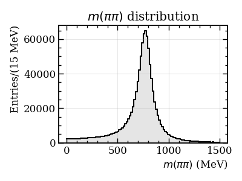

# Tot MC generation and plotting with TensorFlowAnalysis

Example available here: https://github.com/apoluekt/TFA2/blob/master/demos/03_tfa_toymc.py

Here we will see how to do the same thing as in previous example, generation of Breit-Wigner distribution, but now using the `AmpliTF` and `TensorFlowAnalysis` libraries. 

`AmpliTF` contains a library of simple HEP-related functions which can be used with TensorFlow analysis. It also wraps many of the TF basic and mathematical functions in its `amplitf.interface` module with the goal to eventually use TF as one of possible backends. 

Another component of `AmpliTF` is the set of __phase spaces__. Phase spaces are objects which define domains of parameters for e.g. the amplitude models and provides useful associated functions, such as the methods to generate random samples over the domain or the function to check if a given point is inside the domain. When dealing with amplitude models, the phase space in `AmpliTF` is just an object that defines the kinematic phase space of the decay. In this example, we will use the simplest possible phase space, 1D segment representing the invariant mass of two particles in the range from 0 to 1500 MeV. This is defined by 

```python
phsp = RectangularPhaseSpace( ((0., 1500.), ) )
```

`RectangularPhaseSpace` defines rectangular domain in multiple dimensions. The boundaries of the domain are defined in the tuple passed to the constructor. In this case, we have the tuple of 1 element, which is itself a tuple of lower and upper bounds, thus `((0., 1500.), )`. 

Description of the PDF we will generate is done using the complex-valued relativistic Breit-Wigner amplitude from `amplitf.dynamics` module: 
```python
def bw(m, m0, gamma) : 
  ampl = atfd.relativistic_breit_wigner(m**2, m0, gamma)
  return atfd.density(ampl)
```
`atfd.density()` is a short way of doing absolute value squared. 

To run MC generation, we need to fix the values of mass and width and provide a function that has only one input parameter, the 2D tensor where the first index corresponds to the event, and the second to the phase space variable. Since our phase space only has one dimension, the input tensor should have the shape `(N,1)`. The function for the toy model is defined as 
```python
def model(x) : 
  return bw(x[:,0], atfi.const(770.), atfi.const(150.))
```
We are using the fixed resonance mass and width corresponding to rho(770) meson. Note the use of `amplitf.interface` function `atfi.const()`, which is identical to the TF function `tf.constant()`, but specifies the double precision by default. The default floating point precision, double or single, can be set for `AmpliTF` by calling the functions `atfi.set_double_precision()` and `atfi.set_single_precision()`. 

Next, we use the functions from another package, `TensorFlowAnalysis`. While `AmpliTF` aims to only be limited to simple functions and objects, and tries to be decoupled as much as possible from TensorFlow (such that one could use another `numpy`-compatible backend, such as `numpy` itself of `JAX`, by only replacing the interface module), `TensorFlowAnalysis` package is tied more tightly with TensorFlow and provides the interface for toy MC generation, function minimisation using `iminuit`, plotting routines based on `matplotlib` _etc_. 

In this example we use the function `run_toymc()` from `tfa.toymc` module: 
```python
toy_sample = tft.run_toymc(model, phsp, npoints, maximum = 1.e-20, chunk = 1000000).numpy()
```
It takes the PDF function we have defined above, `model`, and the phase space object `phsp`, and generates the dataset of the requested size (`npoints`) using rejection sampling. Generation is done in chunks of fixed size, specified with the parameter `chunk`. One chunk is processed in parallel, then, if the number of selected events is smaller than the requested amount, another chunk is generated, and so on. Rejection sampling approach needs an estimate of the maximum of the PDF, which is passed to the function as well. If the generator finds the PDF value larger than the maximum estimate, it will update the maximum and restart generation from scratch. Thus, if the maximum of the PDF is not known, it is safe to pass a very low value (as we do here), such that it is determined automatically. 

 `tfa.plotting` module contains a few useful functions to plot 1D and 2D histograms from `numpy` arrays, compare several distributions, plot PDFs with components, weighted PDFs, and projections of multidimensional data. Here we are using the function `plot_distr1d` to plot the 1D histogram from the generated data: 
```python
tfp.plot_distr1d(toy_sample[:,0], bins = 100, range = (0., 1500.), ax = ax, label = r"$m(\pi\pi)$", units = "MeV")
```
The functions of `tfa.plotting` module try to mimic as much as possible LHCb publication style in ROOT (set up by calling `tfp.set_lhcb_style()` function). If LaTeX is installed, one can use `usetex=True` option to format all labels with LaTeX, which makes them prettier for publications. 
